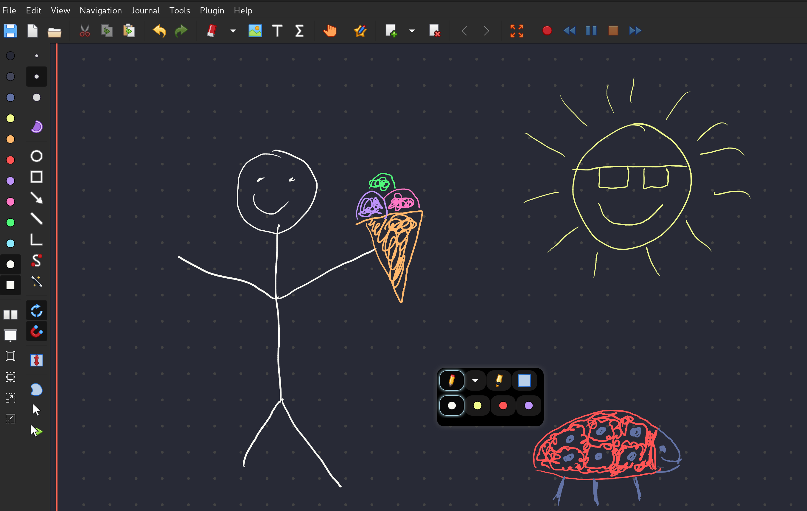

# Dracula for [Xournal++](https://xournalpp.github.io)

> A dark theme with floating toolbar for [Xournal++](https://xournalpp.github.io).

## Install

### Install using Git

If you are a git user, you can install the theme and keep up to date by cloning the repo:

    git clone https://github.com/peit-uiberry/xournalpp-dracula-floatingtoolbar.git

### Install manually

Download using the [GitHub .zip download](https://github.com/peit-uiberry/xournalpp-dracula-floatingtoolbar/archive/refs/heads/master.zip) option and unzip them.

## Activating theme

Append the contents of dracula-toolbar.ini to ~/.xournalpp/toolbar.ini 

    cat dracula-toolbar.ini >> tooblar.ini
In Xournal++, navigate to *View -> Toolbars* and choose the Dracula toolbar 
In Xournal++, navigate to *Journal -> Configure Page Template* and set Background Color to #282a36 
Make sure you have the floating toolbar acessible by assigning it to a stylus button:  
*Edit -> Preferences -> Stylus Buttons*  

I also reccomend changing the border color for curent page to something like #BF4040
